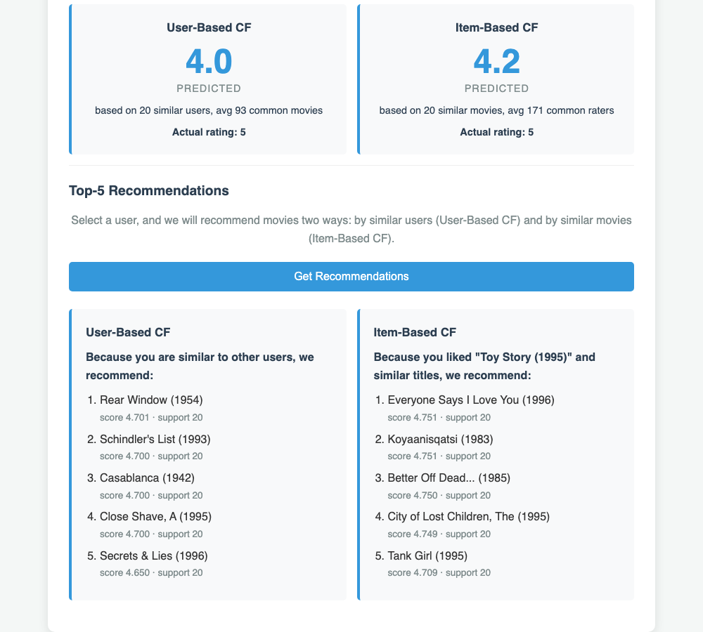
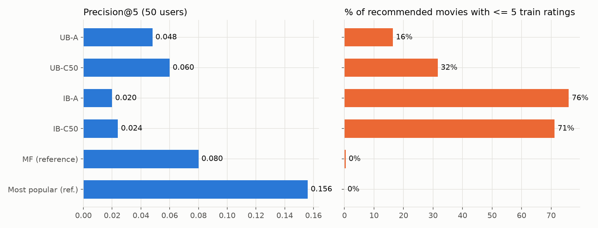
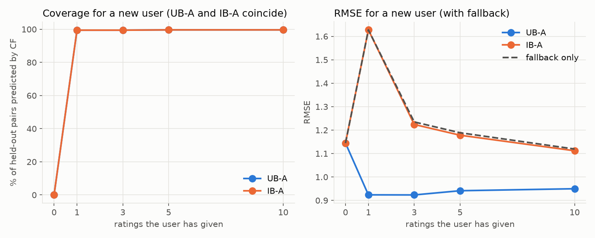
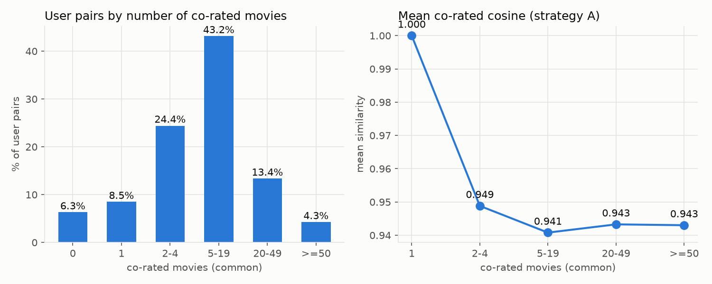
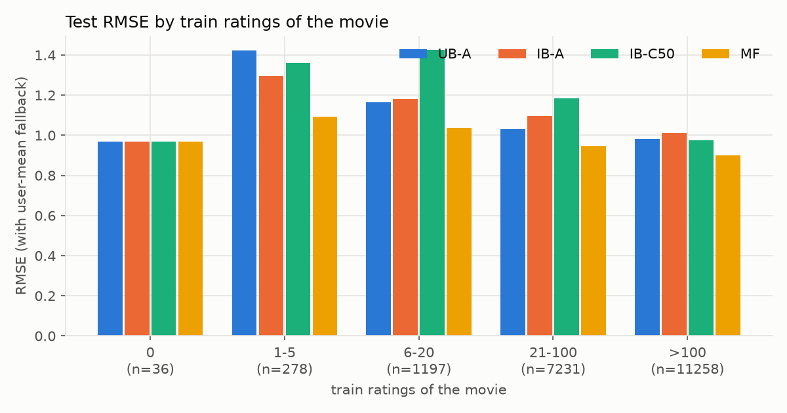

# HW3: Collaborative Filtering Movie Recommender

## 1. Introduction

In this homework I built a movie recommender with collaborative filtering (CF), which uses only ratings, not genres. The page predict a rating for a user and a movie and shows two Top-5 lists. The data is MovieLens 100k: 943 users, 1682 movies and 100,000 ratings from 1 to 5. Only 6.3% of the user×item matrix is filled, so the sparsity is 93.7%.

## 2. Implementation

The app is a static web page (HTML, CSS, JavaScript) with no libraries, so it can work on GitHub Pages.

`data.js` loads `u.item` and `u.data` with `fetch()`. The file `u.item` uses Latin-1, not UTF-8, and some titles were broken, for example "Misérables, Les (1995)". So I read it with `arrayBuffer()` and `new TextDecoder('latin1')`.

`buildRatingMatrix()` makes the rating matrix: one `Float32Array` row per user, indexed by real ids. A value of 0 means "not rated", because real ratings are from 1 to 5. The function also builds helper lists for the speed. They keep the movies of each user, the users of each movie, and the mean rating of each user.

`script.js` has the CF logic and the UI. The similarity and the prediction are:

```
cosine(a, b) = Σ a_k·b_k / ( sqrt(Σ a_k²) · sqrt(Σ b_k²) )    k = positions rated by both (co-rated)
sim'(a, b)   = cosine(a, b) · min(common, β) / β              β = 50, common = number of co-rated positions
prediction   = Σ sim'·r / Σ sim'                              over the top neighbours with sim' > 0
```

- User-Based CF: the neighbours are the N = 20 most similar users who rated the movie.
- Item-Based CF: the neighbours are the K = 20 movies of this user that are most similar to the target movie.
- If there are no neighbours, the prediction is null and the page shows the reason.

In Top-5 a movie must pass two reliability thresholds. The prediction uses at least MIN_SUPPORT = 3 neighbours. The movie has at least MIN_ITEM_RATINGS = 20 ratings. Scores are compared with 1e-6 accuracy, then by support and id, so very small float differences do not change the order.

User-user similarities are computed one time per user. Item-item similarities are computed only for needed pairs and saved in a cache (`Map`). The cache is cleared when user changes, because one Top-5 for a heavy user needs about 340,000 pairs. In JavaScriptCore the Item-Based Top-5 for user 1 took 63 ms on the first click and 20 ms on the second click.




How to run the page:

```
cd week3
python3 -m http.server 8000
```

Open http://localhost:8000 (as a file it does not work, because the browser blocks `fetch()`). Experiments:

```
python3 -m venv --system-site-packages .venv
.venv/bin/pip install matplotlib
.venv/bin/python experiments/evaluate.py
```

## 3. Experiment setup

The script `experiments/evaluate.py` saves results to `experiments/results/`. Every user have at least 20 ratings. For each user I put a random 20% of the ratings into test and 80% into train (seed 42). Train has 80,000 ratings and test has 20,000. All 943 users stay in train. 32 test movies have no ratings in train (36 test pairs).

Metrics:

- RMSE and MAE. For null predictions I use the user mean as fallback.
- Coverage: the share of test pairs where the method itself gave a prediction.
- Precision@5 for 50 random users: a movie is relevant if it is in the user's test with rating 4 or 5. Candidates are all movies not rated in train.
- Time: preparation (similarity matrix or training) and prediction of the whole test.

## 4. User-Based vs Item-Based

First, the general theory. The choice depend from the shape of the data. A user-user similarity uses the movies both users rated, and an item-item similarity uses the users who rated both movies. If users ≫ items, every item has many ratings. Then item-item similarities are cheap (few item pairs) and stable (a lot of data). They change slowly, so we can compute them in advance. This is why big shops like Amazon use item-based CF. If items ≫ users, it is the opposite: user-based CF is cheaper and more stable.

Our case is the second one: 1682 movies and 943 users. Movies have less ratings than users: 47.6 train ratings per movie and 84.8 per user on average.

| | User-Based | Item-Based |
|---|---|---|
| Entities | 943 users | 1682 movies |
| Pairs (n²) | 889,249 | 2,829,124 |
| Mean train ratings per entity | 84.8 | 47.6 |
| Mean co-rated items per pair | 12.1 | 4.5 |
| Pairs with no co-rated items | 6.3% | 39.6% |
| Full similarity matrix (numpy) | 0.028 s | 0.055 s |
| RMSE / MAE, strategy A (co-rated) | 1.019 / 0.806 | 1.057 / 0.836 |
| RMSE / MAE, strategy C (β = 50) | 1.019 / 0.809 | 1.091 / 0.846 |
| Prediction time for test, strategy A | 0.19 s | 0.11 s |
| Similarity stability r, strategy A | 0.36 | 0.19 |
| Similarity stability r, strategy C (β = 50) | 0.76 | 0.78 |

Item-Based has 3 times more pairs, and its matrix takes 2 times longer. User-Based is more accurate: RMSE 1.019 against 1.057.

For stability, I computed similarities on two random halves of train and compared pairs with at least 5 common ratings in both. With strategy A the correlation is 0.36 for users and only 0.19 for movies. With C both are about 0.77, but this number is too high, because min(common, β)/β is almost the same in both halves.

So item similarities are less stable here. This is not against the theory. It agrees with it: the side with more ratings per entity gives better similarities, and here it is the users.

## 5. Missing-value strategy trade-off

A uses only co-rated items. B fills missing values with the user mean (UB) or movie mean (IB). C is A with significance weighting. D is matrix factorization (MF) with SGD: μ + b_u + b_i + p_u·q_i, k = 20.

| Strategy | Simplicity | Bias | Computing cost | RMSE UB | RMSE IB | Prep time UB / IB |
|---|---|---|---|---|---|---|
| A co-rated only | simple | sim = 1.0 for pairs with 1 common item | low | 1.019 | 1.057 | 0.034 / 0.064 s |
| B mean imputation | simplest | pulls everything to the mean | low time, dense vectors | 1.049 | 1.080 | 0.007 / 0.011 s |
| C weighted, β = 10 | simple, one parameter | less noise when there are few common items | same as A | 1.015 | 1.046 | 0.035 / 0.067 s |
| C weighted, β = 50 | simple, one parameter | less noise when there are few common items | same as A | 1.019 | 1.091 | 0.034 / 0.066 s |
| D matrix factorization | complex | learns user and item biases | high | 0.929 | (one model) | 11.8 s |
| Baselines | | | | global mean 1.128, user mean 1.050, item mean 1.021 | | |

B is the easiest idea. But after filling, all vectors look like the mean, so almost every pair looks similar. B is worse than A for both methods.

C costs only one multiplication. With β = 10 it is the best CF result (UB 1.015, IB 1.046). With β = 50 it is not better for UB and worse for IB (1.091). I still chose β = 50 for the app, because with it the neighbours have more common movies. With A, 19 of the top-20 neighbours of a typical user have fewer than 5 common movies. With C (β = 50), none.

C has one limit: it does not change the score of a rare movie. All neighbours of a rare movie have common = 1 or 2, so C multiplies all their weights by the same small number. A weighted average Σ sim'·r / Σ sim' does not change if all weights are multiplied by one number. In this case it give the same score as before:

| Top-5 config (50 users) | P@5 | Median popularity | Recs with ≤ 5 ratings |
|---|---|---|---|
| UB, A | 0.048 | 81.5 | 16.4% |
| UB, C (β = 50) | 0.060 | 54 | 31.6% |
| IB, A | 0.020 | 2 | 76.0% |
| IB, C (β = 50) | 0.024 | 2 | 71.2% |
| UB, C (β = 50), ≥ 20 ratings | 0.104 | 214 | 0% |
| IB, C (β = 50), ≥ 20 ratings | 0.064 | 45 | 0% |
| MF | 0.080 | 142 | 0.4% |
| Most popular | 0.156 | 405 | 0% |

Without a popularity threshold, 71% of Item-Based recommendations have 5 or fewer ratings, even with C. Only the threshold of 20 ratings removes them, and then UB with C has the best CF precision (0.104).



MF is different with the other methods. It has the best RMSE (0.929), but training takes 11.8 s against 0.03 to 0.06 s for a similarity matrix. It needs hyperparameters and early stopping. On the validation set (10% of train) the best epoch was 20 (RMSE 0.915). At epoch 30 the RMSE was 0.927. MF is also harder to explain.

## 6. Cold start and sparsity

CF compares rows (users) or columns (movies). A new user or a new movie has no data, so there is nothing to compare. A new user gives no informations to the system. In our split, 32 test movies had no train ratings, and every CF method used the fallback for them.

I also simulated new users. I took 5 users (82, 394, 397, 587, 710) and kept 0, 1, 3, 5 or 10 of their ratings in train. Their other 553 ratings were the test.

| Ratings kept | Coverage UB = IB | RMSE UB-A | RMSE IB-A | RMSE UB-C | RMSE fallback only |
|---|---|---|---|---|---|
| 0 | 0% | 1.145 | 1.145 | 1.145 | 1.145 |
| 1 | 99.5% | 0.924 | 1.628 | 0.924 | 1.628 |
| 3 | 99.5% | 0.923 | 1.224 | 0.903 | 1.235 |
| 5 | 99.6% | 0.941 | 1.178 | 0.891 | 1.189 |
| 10 | 99.6% | 0.950 | 1.112 | 0.864 | 1.119 |

With 0 ratings CF can do nothing: coverage is 0. With 1 rating, IB repeats this rating, like the fallback. UB looks good, but all raters of that movie get sim = 1.0, so the neighbours are almost random. With UB-C, when the user has more ratings (from 1 to 10), the error goes down from 0.924 to 0.864.



The second problem is too little evidence. We discuss about this problem with numbers. Of 444,153 user pairs, 37,739 (8.5%) have only one common movie, and all of them have cosine exactly 1.0. For 2 or more common movies the mean similarity is about 0.94, and it is almost the same for any number of common movies. So co-rated cosine on positive ratings cannot show which users are really similar.



The first version of the app used strategy A and no threshold. Its User-Based Top-5 for user 1 started with "Star Kid (1997)" and "Prefontaine (1997)". Each had only 3 ratings, all 5 stars. The Item-Based Top-5 started with "Chairman of the Board (1998)" with one rating. For user 13 and "Star Wars (1977)" (real rating 5), Item-Based predicted 2.6 with A and 4.3 with C. Weighting fixed this prediction, but the rare movies left the Top-5 only after the threshold.

The error also depends on the popularity of the movie:

| Train ratings of the movie | Test pairs | UB-A | IB-A | IB-C (β = 50) | MF |
|---|---|---|---|---|---|
| 0 | 36 | 0.970 | 0.970 | 0.970 | 0.970 |
| 1-5 | 278 | 1.424 | 1.294 | 1.362 | 1.094 |
| 6-20 | 1197 | 1.164 | 1.180 | 1.425 | 1.038 |
| 21-100 | 7231 | 1.032 | 1.096 | 1.185 | 0.947 |
| >100 | 11258 | 0.982 | 1.011 | 0.974 | 0.899 |

For rare movies (1 to 20 ratings) the CF error is between 1.16 and 1.43. MF is the best in every group.



In practice, a new user gets popular movies or a few questions at registration ("rate 10 movies", "choose your favourite genres"). For a new movie, content-based filtering helps, because genres exist from the first day. Real systems usually use a hybrid: content-based or popularity at the start, CF when there are enough ratings.

## 7. Conclusion

- The browser results are the same as in a numpy reference script.
- User-Based CF is more accurate than Item-Based here (RMSE 1.019 vs 1.057), because users have more ratings than movies. This agrees with the theory.
- Co-rated cosine gives high similarity even when users have only 1 or 2 common movies. With significance weighting (β = 50) the neighbours have more common movies.
- Weighting does not remove rare movies from Top-5. A popularity threshold is needed.
- MF has the best RMSE (0.929), but it is slower and harder to explain.
- CF cannot help a user or a movie with no ratings. A fallback or a hybrid is necessary.

Limitations:

- Only one random split, so the numbers can change a little with another seed.
- Precision@5 uses only 50 users (250 recommendations). One hit changes P@5 by 0.004, so small differences are noise.
- "Most popular" has the best Precision@5 (0.156). The test has many popular movies, so this metric is better for popular movies.
- The new-user simulation uses only 5 users and 553 ratings.
